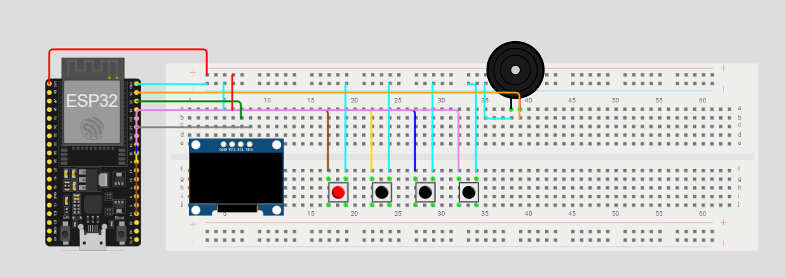

# MYGECKO PET
MyGecko adalah virtual pet berbasis ESP32 yang terinspirasi dari konsep Tamagotchi. Sistem ini menampilkan karakter gecko hitam putih pada OLED 128x64 dan dapat berinteraksi dengan pengguna melalui tombol, sensor sentuh, dan buzzer.

Karakter dapat menampilkan berbagai respons seperti idle, makan, menolak saat kenyang, dance mode, serta interaksi sentuhan.

---

[](https://youtu.be/9jbW2efTI9A)

## 1. Cara Kerja
Saat perangkat dinyalakan, ESP32 akan menginisialisasi seluruh komponen seperti OLED, tombol, touch sensor, dan buzzer. Setelah aktif, karakter MyGecko akan muncul pada layar OLED dalam kondisi idle animation.

Pengguna dapat berinteraksi melalui:
#### Tombol kiri (Feed)
Digunakan untuk memberi makan MyGecko.
- Jika status masih tersedia → animasi makan
- Jika status sudah penuh → animasi **No No**

#### Tombol tengah (Status)
Menampilkan kondisi/status karakter.

#### Tombol kanan (Dance Mode)
Menjalankan animasi dance dan buzzer memainkan melodi.

#### Touch Sensor
- Double tap pada sensor untuk mengelus MyGecko.
- Karakter akan merespons dengan animasi pat-pat.

---
## 2. Alat dan Bahan

| N
o | Komponen | Jumlah |
|---|---|---:|
| 1 | ESP32 | 1 |
| 2 | OLED SSD1306 128x64 | 1 |
| 3 | Push Button | 3 |
| 4 | Touch Sensor | 1 |
| 5 | Passive Buzzer | 1 |
| 6 | Breadboard | 1 |
| 7 | Kabel Jumper | Secukupnya |

---
## 3. Wiring Diagram

```md

```

Atau gunakan link berikut:
🔗 https://wokwi.com/projects/465442161607389185

#### Tabel Koneksi

| Komponen | GPIO ESP32 |
|---|---:|
| Sensor Touch | 15 |
| Tombol Kiri | 5 |
| Tombol Tengah | 18 |
| Tombol Kanan | 19 |
| Buzzer | 23 |
| OLED SDA | SDA |
| OLED SCL | SCL |
| OLED VCC | 3.3V |
| OLED GND | GND |

---

## 4. Struktur Sistem
```text
+---------------------+     +---------------------+     +----------------------+
|        INPUT        | --> |        ESP32        | --> |        OUTPUT        |
|---------------------|     |---------------------|     |----------------------|
| Tombol Kiri         |     | Arduino Framework   |     | OLED SSD1306         |
| Tombol Tengah       |     | FreeRTOS            |     | Animasi MyGecko      |
| Tombol Kanan        |     | State Machine       |     | Buzzer               |
| Touch Sensor        |     | Event Queue         |     | Respons Interaktif   |
+---------------------+     +---------------------+     +----------------------+
```

## 5. Struktur Proyek
```bash
MyGecko/
│
├── main.cpp
├── MainDisplay.h
├── Eat.h
├── Dance.h
├── Patpat.h
├── Nono.h
└── README.md
```
Setiap file `.h` berisi kumpulan frame bitmap OLED:
- `MainDisplay.h` → animasi idle
- `Eat.h` → animasi makan
- `Dance.h` → animasi menari
- `Patpat.h` → animasi pat-pat
- `Nono.h` → animasi ekspresi tambahan


## 6. Penjelasan Kode
### Library yang digunakan:
- Adafruit GFX
- Adafruit SSD1306
- Wire
- Arduino ESP32 Core
- FreeRTOS

### Enum Event
```cpp
enum EventType {
  EV_NONE,
  EV_PAT,
  EV_EAT,
  EV_STATS,
  EV_MUSIC
};
```

Digunakan untuk menentukan jenis event dari input pengguna.

---

### Membuat Task
```cpp
xTaskCreate(TaskDisplay, "Task Display", 6144, NULL, 1, NULL);
xTaskCreate(TaskInput, "Task Input", 2048, NULL, 1, NULL);
xTaskCreate(TaskAudio, "Task Audio", 2048, NULL, 1, NULL);
```

Membagi sistem menjadi beberapa task agar berjalan multitasking.

---

### Menampilkan Idle Animation
```cpp
displayI2c.drawBitmap(
    0,
    0,
    video_frames[animationFrame],
    SCREEN_WIDTH,
    SCREEN_HEIGHT,
    SSD1306_WHITE
);
```

Menampilkan frame bitmap ke OLED.

---

### Membaca Event
```cpp
if (xQueueReceive(eventQueue, &newEvent, 0) == pdTRUE) {...}
```

Digunakan untuk membaca input dari queue.

---

### Double Tap Touch Sensor

Touch sensor membaca dua sentuhan dalam waktu tertentu.

Jika berhasil:

```cpp
EV_PAT
```

akan dikirim ke sistem lalu menampilkan animasi pat-pat.

---

## Repository
Dibuat oleh Atik Ahnafi dan Imedia Sholem untuk kebutuhan akademik

Github:
https://github.com/ahnafi/mygecko.git

---


